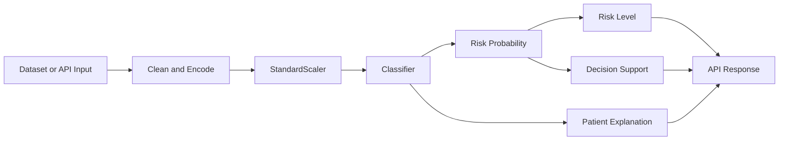

# MediScope AI ML Architecture

## 1. Purpose

MediScope AI estimates risk for heart disease, diabetes, and stroke. It is a research and decision-support system, not a diagnostic system. A prediction is an estimate produced from a dataset-trained model and must be reviewed in clinical context.

## 2. Data Sources

The repository contains three CSV datasets under `ml_service/data`:

| File           | Dataset family                         | Target    | Main characteristics                                                  |
| -------------- | -------------------------------------- | --------- | --------------------------------------------------------------------- |
| `heart.csv`    | UCI/Cleveland-style heart disease data | `target`  | Numeric clinical and exercise-test features                           |
| `diabetes.csv` | Pima Indians Diabetes-style data       | `Outcome` | Numeric metabolic and demographic features                            |
| `stroke.csv`   | Public stroke-prediction dataset       | `stroke`  | Numeric and categorical demographic, lifestyle, and clinical features |

The exact download URL, collection protocol, patient population, licensing, and preprocessing history should be recorded in the final dissertation. Dataset size and representativeness are limitations, especially for the highly imbalanced stroke target. No external validation cohort is currently included.

## 3. Disease-Specific Pipelines

Each disease has an independent preprocessing and inference path:



- Heart features are numeric and use the ordered clinical vector defined in `api/app.py`.
- Diabetes features are numeric and use the ordered metabolic vector defined in `api/app.py`.
- Stroke data removes the identifier, imputes BMI, and one-hot encodes categorical fields. API input is encoded by `encode_stroke_input` before scaling.
- Missing training values are cleaned by `ml_service/utils/preprocess.py`. This is a simple baseline strategy and should be compared with clinically justified imputation in future work.

## 4. Model Families

The shared trainer in `ml_service/utils/train_model.py` trains:

1. **Logistic Regression**: an interpretable linear baseline. Class balancing is enabled.
2. **Random Forest**: a nonlinear bagging model. Class balancing and a fixed random seed are enabled.
3. **XGBoost**: a nonlinear gradient-boosted tree model. `scale_pos_weight` is derived from the training class counts.

Every trained model is saved as `{disease}_{model}.pkl`. The selected model is saved as `{disease}_best.pkl`, and the scaler is saved as `{disease}_scaler.pkl`.

## 5. Metrics

The evaluation contract includes:

- **Accuracy**: overall proportion of correct classifications.
- **Precision**: proportion of predicted positives that are positive.
- **Recall / sensitivity**: proportion of actual positives detected. This is the priority metric for screening because false negatives can be harmful.
- **F1-score**: harmonic mean of precision and recall.
- **ROC-AUC**: ranking quality over classification thresholds.
- **PR-AUC**: especially useful for imbalanced outcomes such as stroke.
- **Brier score**: squared probability error and a basic probability-quality measure.

For a binary outcome, recall is:

```text
Recall = TP / (TP + FN)
```

The production threshold is currently `0.5`. A research-grade screening study should tune and justify a disease-specific threshold on validation data, then report the resulting sensitivity, specificity, precision, and negative predictive value.

## 6. Model Selection

The shared trainer selects the model using this lexicographic rule:

```text
highest validation recall -> highest validation F1-score
```

This reflects the screening objective. Accuracy must not be the sole selection criterion. Selection should eventually be performed with repeated stratified cross-validation or a train/validation/test protocol so that the reported winner is not dependent on one random split.

The legacy `ml_service/train.py` script is an older heart-only trainer and should not be used as the authoritative training entry point. Use the disease-specific scripts that call `utils.train_model.train_pipeline`.

## 7. Multitask Research Model

`ml_service/train_mtl.py` trains a PyTorch shared-representation model with three output heads: heart, diabetes, and stroke. The combined adapter maps each disease dataset into a common 27-feature space. Labels not available for a row are represented by `-1` and masked out of the loss.

This is a useful multitask-learning prototype, but the combined data is formed by concatenating separate disease cohorts. It does not prove that all three outcomes were observed for the same patients. That distinction must be explicit in the research methodology and limitations.

## 8. Explainability

- Logistic Regression uses signed coefficient-times-scaled-value attribution.
- Tree models use SHAP `TreeExplainer`.
- The multitask model uses a separate SHAP `DeepExplainer` wrapper for each output head.
- Responses return the highest-impact factors with direction and feature name.

The multitask explainer currently uses an all-zero background. This is computationally convenient but not a representative patient distribution. A stronger study should use a sampled, training-set background and evaluate explanation stability, agreement with domain knowledge, and clinician comprehension.

## 9. Calibration and Uncertainty

The research endpoint currently includes:

- Temperature transformation of multitask probabilities.
- MC dropout standard deviation over repeated predictions.
- A confidence label and selective abstention when uncertainty is high.

The current temperature is fixed at `1.5`; it is not learned from validation data. Confidence labels are therefore heuristic. Future work should fit calibration on held-out data and report reliability diagrams, expected calibration error, and Brier score before and after calibration.

## 10. Simulation Architecture

The Node and Flask services expose:

```text
POST /api/simulate/:disease
```

Example request:

```json
{
  "baseline": {
    "Glucose": 180,
    "BloodPressure": 90,
    "BMI": 32,
    "Age": 50
  },
  "scenarios": {
    "reduced_glucose": { "Glucose": 130 },
    "reduced_bmi": { "BMI": 25 }
  }
}
```

The response reports baseline risk, each scenario risk, risk change, and the changed parameters. The existing browser sandbox is implemented for heart disease; diabetes and stroke require frontend scenario controls before the full user-facing feature is complete.

Simulation results are counterfactual model outputs, not clinical treatment predictions. They should be described as sensitivity analysis and should not claim a causal effect of changing a parameter.

## 11. Current Evidence and Required Research Reporting

The checked-in research report should include, for every disease and model:

- Dataset size and positive-class prevalence.
- Train/test or cross-validation protocol and random seed.
- Accuracy, precision, recall, F1, ROC-AUC, PR-AUC, and Brier score.
- Confusion matrix and threshold used.
- Model-selection rule and whether it was fixed before evaluation.
- Calibration and uncertainty method.
- Feature-importance and patient-level explanation examples.
- Subgroup performance where sample size permits.
- External-validation status.

The current stroke report shows high accuracy but zero recall and zero F1 at the checked-in threshold. This is a warning about class imbalance and threshold behavior, not evidence of a strong stroke predictor.

## 12. Relevant Implementation Sources

- Training: `ml_service/utils/train_model.py`
- Cleaning: `ml_service/utils/preprocess.py`
- Disease scripts: `ml_service/train_heart.py`, `train_diabetes.py`, `train_stroke.py`
- Evaluation: `ml_service/evaluation/evaluate_models.py`
- Multitask adapter: `ml_service/preprocessing/mtl_adapter.py`
- Flask inference: `ml_service/api/app.py`
- Baseline explanations and alerts: `ml_service/explainability/baseline_explainer.py`
- Multitask SHAP: `ml_service/explainability/explainer.py`
- Uncertainty: `ml_service/uncertainty/estimator.py`
- Calibration: `ml_service/calibration/calibrator.py`
- Selective prediction: `ml_service/inference/selective_predictor.py`
