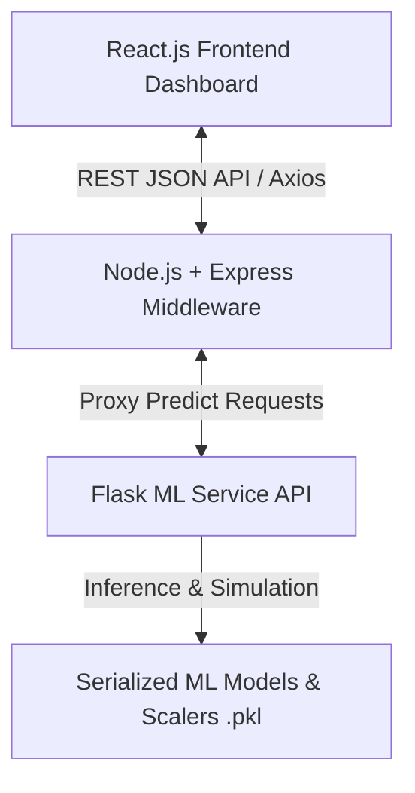

# 🧠 MediScope AI

### A Unified Multi-Disease Prediction System with Explainable AI and Clinical Decision Support

---

## 🚀 Overview

MediScope AI is a comprehensive healthcare intelligence platform designed to predict multiple chronic diseases including **Heart Disease, Diabetes, and Stroke** using Machine Learning techniques. The system integrates predictive analytics with explainability and clinical decision support to enhance trust and usability in medical environments.

---

## 🎯 Objectives

* Predict risk of multiple diseases using ML models
* Provide explainable insights into predictions
* Support clinical decision-making with recommendations
* Enable early detection and prevention

---

## 🧠 Features

* Multi-disease prediction (Heart, Diabetes, Stroke)
* Model comparison (Logistic, Random Forest, XGBoost)
* Class imbalance handling
* Confusion matrix & evaluation metrics
* Best model selection using F1-score / Recall
* Scalable ML pipeline
* REST API for real-time prediction (Flask)
* Risk scoring (probability-based output)
* Risk categorization (Low / Medium / High)

---

## ⚙️ Tech Stack

* Python (Pandas, Scikit-learn, XGBoost)
* Flask (ML API)
* Machine Learning Models
* Data Preprocessing & Feature Engineering
* (Upcoming) Node.js, React.js

# ✅ Current Features & Completed Phases

---

## 🩺 Phase 1 & 2: Machine Learning Pipeline & Disease Prediction Modules
- ❤️ **Heart Disease Prediction** (Trained using Best Model selection)
- 🩸 **Diabetes Prediction**
- 🧠 **Stroke Prediction** (Imbalance handling via XGBoost/Random Forest/Logistic Regression)
- 🔥 **Unified Predict All Screening**
- Automatic model selection prioritizing Recall & F1-score for clinical reliability.

---

## 🔷 Phase 3: Node.js Backend & Middleware Architecture
- Robust Express.js backend decoupling frontend from Flask ML inference services.
- Automated input validation and centralized API routing (`/api/predict/heart`, `/api/predict/all`).
- Modular logging, error handling, and secure cross-origin resource sharing (CORS).

---

## 🎨 Phase 4: Professional Frontend React.js Dashboard
- Modern, visually immersive medical UI styled with clean card glassmorphism and tailored color palettes.
- Dedicated screening forms with progressive disclosure (Essential vs. Advanced cardiology inputs).
- Dynamic progress gauges and color-coded risk stratification badges (Low / Medium / High).

---

## 🔥 Phase 5: Advanced Features & Core Innovation (❤️ Heart Disease Module)

### 🔹 Real-Time Risk Evolution Engine (Interactive Sandbox)
- **Live What-If Simulation:** Features tactile range sliders for resting blood pressure, serum cholesterol, and maximum heart rate on exertion.
- **Dynamic Inference:** Re-calculates and renders shifts in cardiac risk percentages in real-time as medical practitioners or patients adjust baseline vital signs.

### 🔹 Patient Scenario Simulation
- **Side-by-Side Clinical Trajectories:** Demonstrates potential long-term prognosis.
  - **Untreated / Worsening Trajectory:** Models 3–5 year risk amplification without medication or lifestyle compliance (e.g., BP +20 mmHg, Cholesterol +45 mg/dL).
  - **Treated & Optimized Target:** Models projected disease risk reduction under strict adherence to cardiovascular treatment goals and lifestyle modification.

### 🔹 Smart Alert System
- Automated automated detection of high-risk physiological patterns or acute clinical thresholds (e.g., hypertensive crisis or severe hypercholesterolemia).
- Displays immediate color-coded alerts (🚨 Critical Alert, ⚠️ Preventive Warning, 🟢 Favorable Profile) with clear action steps.

---

## 🧠 Phase 6: Explainable AI (XAI) & Clinical Decision Support (❤️ Heart Disease Module)

### 🔹 Transparent Prediction Interpretability (XAI)
- Eliminates AI black-box mystery by revealing the underlying physiological factors driving prediction results.
- Classifies individual vital indicators into **High Impact**, **Medium Impact**, and **Low Impact** contributors.
- Provides plain-English clinical summaries describing exactly how elevated blood pressure, cholesterol, age, or anginal symptoms impact arterial workload and atherosclerosis.

### 🔹 Clinical Decision Support (CDS) Action Plan
- Delivers structured, evidence-based preventive care recommendations tailored to patient evaluations.
- Offers guidance on vital signs monitoring targets, Mediterranean nutrition habits, sodium intake thresholds, and aerobic exercise targets.

---

# 🚀 REMAINING PHASES (NEXT MILESTONES)

---

## 🔷 Expansion of Phase 5 (Core Innovation) & Phase 6 (XAI)
- **Diabetes Module Enhancement:** Build real-time glycemic simulation (modifying glucose, insulin, and BMI) and XAI breakdown for metabolic resistance.
- **Stroke Module Enhancement:** Build neurological stroke trajectory simulation (modifying hypertension, glucose, and lifestyle factors) and feature impact mapping.

---

## 🌐 Phase 7: Public Cloud Deployment
### 🎯 Objective
Launch MediScope AI as a live healthcare SaaS web application.
- **Flask ML API:** Deploy containerized machine learning service to Render / Railway / Google Cloud Run.
- **Node.js Express Backend:** Deploy API Gateway and validation middleware to Render / Fly.io.
- **React Frontend Dashboard:** Deploy production-optimized build to Vercel / Netlify.

---

# 🏁 System Architecture

---

# 📜 ABSTRACT

Chronic diseases such as heart disease, diabetes, and stroke are among the leading causes of mortality and long-term health complications worldwide. Early detection and timely intervention play a crucial role in improving patient outcomes and reducing healthcare burden. However, traditional machine learning-based prediction systems often operate as black-box models, limiting their adoption in clinical settings due to a lack of transparency and interpretability.

This project presents *MediScope AI*, a Unified Multi-Disease Prediction System that integrates machine learning, explainable artificial intelligence (XAI), real-time risk evolution simulation, and clinical decision support to address these challenges. The system predicts the risk of heart disease, diabetes, and stroke using patient health data through a scalable and modular multi-tier architecture (React.js, Node.js, and Flask).

Multiple machine learning models, including Logistic Regression, Random Forest, and XGBoost, are evaluated using accuracy, precision, recall, and F1-score, with special emphasis placed on recall for life-threatening conditions. Within the Heart Disease module, MediScope AI pioneers a Real-Time Risk Evolution Sandbox and Patient Scenario Simulator, allowing clinicians and patients to dynamically explore therapeutic outcomes and disease progression under varying diagnostic conditions. By pairing these simulations with transparent feature-impact XAI breakdowns and automated Smart Alerts, MediScope AI bridges the gap between raw machine learning computation and actionable real-world healthcare intervention.

---
