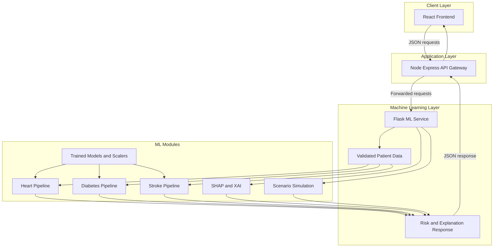

# 🧠 MediScope AI

### A Unified Multi-Disease Prediction System with Explainable AI and Clinical Decision Support

---

## 🚀 Overview

MediScope AI is a comprehensive healthcare intelligence platform designed to predict multiple chronic diseases including **Heart Disease, Diabetes, and Stroke** using Machine Learning techniques. The system integrates predictive analytics with explainability and clinical decision support to enhance trust and usability in medical environments.

---

## 🎯 Objectives

- Predict risk of multiple diseases using ML models
- Provide explainable insights into predictions
- Support clinical decision-making with recommendations
- Enable early detection and prevention

---

## 🧠 Features

- Multi-disease prediction (Heart, Diabetes, Stroke)
- Model comparison (Logistic, Random Forest, XGBoost)
- Class imbalance handling
- Confusion matrix & evaluation metrics
- Best model selection using F1-score / Recall
- Scalable ML pipeline
- REST API for real-time prediction (Flask)
- Risk scoring (probability-based output)
- Risk categorization (Low / Medium / High)

---

## ⚙️ Tech Stack

- Python (Pandas, Scikit-learn, XGBoost)
- Flask (ML API)
- Machine Learning Models
- Data Preprocessing & Feature Engineering
- (Upcoming) Node.js, React.js

# ✅ Current Features & Completed Phases

---

## ✅ Phase 1 & 2: Machine Learning Pipeline & Disease Prediction Modules

- ❤️ **Heart Disease**: Clinical classification using age, cholesterol, resting BP, etc.
- **Diabetes Assessment**: Early detection based on insulin, BMI, glucose, and pedigree functions.
- **Stroke Prediction (Phase 5)**: Advanced categorical encoding & XGBoost baseline.
- **Multi-Task Learning (Phase 7 - Research Grade)**: Deep learning PyTorch architecture predicting all 3 diseases simultaneously through a shared representation layer.
- **Trustworthy AI Layer (Phase 7)**:
  - **Explainability (SHAP)**: Identifies top feature drivers dynamically per patient.
  - **Uncertainty Estimation**: Uses MC Dropout to quantify model confidence.
  - **Calibration**: Temperature scaling applied to model logits.
  - **Selective Abstention**: Automated human-in-the-loop fallback when confidence is low.

## Tech Stack

- **Frontend**: React.js + Vite (Dynamic Research Dashboard)
- **Backend API Gateway**: Node.js + Express
- **Machine Learning API**: Python + Flask
- **ML/DL Models**: PyTorch (MTL), Scikit-Learn, XGBoost, SHAP

---

## ✅ Phase 3: Node.js Backend & Middleware Architecture

- Robust Express.js backend decoupling frontend from Flask ML inference services.
- Automated input validation and centralized API routing (`/api/predict/heart`, `/api/predict/all`).
- Modular logging, error handling, and secure cross-origin resource sharing (CORS).

---

## ✅ Phase 4: Professional Frontend React.js Dashboard

- Modern, visually immersive medical UI styled with clean card glassmorphism and tailored color palettes.
- Dedicated screening forms with progressive disclosure (Essential vs. Advanced cardiology inputs).
- Dynamic progress gauges and color-coded risk stratification badges (Low / Medium / High).

---

## ✅ Phase 5: Advanced Features & Core Innovation (❤️ Heart Disease Module)

### 🔹 Real-Time Risk Evolution Engine (Interactive Sandbox)

- **Live What-If Simulation:** Features tactile range sliders for resting blood pressure, serum cholesterol, and maximum heart rate on exertion.
- **Dynamic Inference:** Re-calculates and renders shifts in cardiac risk percentages in real-time as medical practitioners or patients adjust baseline vital signs.

### 🔹 Patient Scenario Simulation

- **Side-by-Side Clinical Trajectories:** Demonstrates potential long-term prognosis.
  - **Untreated / Worsening Trajectory:** Models 3–5 year risk amplification without medication or lifestyle compliance (e.g., BP +20 mmHg, Cholesterol +45 mg/dL).
  - **Treated & Optimized Target:** Models projected disease risk reduction under strict adherence to cardiovascular treatment goals and lifestyle modification.

### 🔹 Smart Alert System

- Automated automated detection of high-risk physiological patterns or acute clinical thresholds (e.g., hypertensive crisis or severe hypercholesterolemia).
- Displays immediate color-coded alerts (🚨 Critical Alert, ⚠️ Preventive Warning, 🟢 Favorable Profile) with clear action steps.

---

## ✅ Phase 6: Explainable AI (XAI) & Clinical Decision Support (❤️ Heart Disease Module)

### 🔹 Transparent Prediction Interpretability (XAI)

- Eliminates AI black-box mystery by revealing the underlying physiological factors driving prediction results.
- Classifies individual vital indicators into **High Impact**, **Medium Impact**, and **Low Impact** contributors.
- Provides plain-English clinical summaries describing exactly how elevated blood pressure, cholesterol, age, or anginal symptoms impact arterial workload and atherosclerosis.

### 🔹 Clinical Decision Support (CDS) Action Plan

- Delivers structured, evidence-based preventive care recommendations tailored to patient evaluations.
- Offers guidance on vital signs monitoring targets, Mediterranean nutrition habits, sodium intake thresholds, and aerobic exercise targets.

---

# 🚀 REMAINING PHASES (NEXT MILESTONES)

---

## 🔷 Expansion of Phase 5 (Core Innovation) & Phase 6 (XAI)

- **Diabetes Module Enhancement:** Build real-time glycemic simulation (modifying glucose, insulin, and BMI) and XAI breakdown for metabolic resistance.
- **Stroke Module Enhancement:** Build neurological stroke trajectory simulation (modifying hypertension, glucose, and lifestyle factors) and feature impact mapping.

---

## 🌐 Phase 7: Public Cloud Deployment

### 🎯 Objective

Launch MediScope AI as a live healthcare SaaS web application.

- **Flask ML API:** Deploy containerized machine learning service to Render / Railway / Google Cloud Run.
- **Node.js Express Backend:** Deploy API Gateway and validation middleware to Render / Fly.io.
- **React Frontend Dashboard:** Deploy production-optimized build to Vercel / Netlify.

---

# 🏁 System Architecture

---

# 📜 ABSTRACT

Chronic diseases such as heart disease, diabetes, and stroke are among the leading causes of mortality and long-term health complications worldwide. Early detection and timely intervention play a crucial role in improving patient outcomes and reducing healthcare burden. However, traditional machine learning-based prediction systems often operate as black-box models, limiting their adoption in clinical settings due to a lack of transparency and interpretability.

This project presents _MediScope AI_, a Unified Multi-Disease Prediction System that integrates machine learning, explainable artificial intelligence (XAI), real-time risk evolution simulation, and clinical decision support to address these challenges. The system predicts the risk of heart disease, diabetes, and stroke using patient health data through a scalable and modular multi-tier architecture (React.js, Node.js, and Flask).

Multiple machine learning models, including Logistic Regression, Random Forest, and XGBoost, are evaluated using accuracy, precision, recall, and F1-score, with special emphasis placed on recall for life-threatening conditions. Within the Heart Disease module, MediScope AI pioneers a Real-Time Risk Evolution Sandbox and Patient Scenario Simulator, allowing clinicians and patients to dynamically explore therapeutic outcomes and disease progression under varying diagnostic conditions. By pairing these simulations with transparent feature-impact XAI breakdowns and automated Smart Alerts, MediScope AI bridges the gap between raw machine learning computation and actionable real-world healthcare intervention.

---

# Project Scope and Contribution

## Research Contribution

The research question is:

> Can machine-learning models predict multiple chronic-disease risks while providing patient-level explanations and showing how predictions change when health parameters are modified?

The research contribution consists of:

- Comparative evaluation of Logistic Regression, Random Forest, and XGBoost for heart disease, diabetes, and stroke.
- Recall-focused evaluation because missed positive cases are especially important in screening.
- Patient-level feature attribution using SHAP for tree-based models and coefficient-based attribution for Logistic Regression.
- A dynamic risk-evolution study that measures the change in predicted probability after controlled parameter changes.
- Analysis of feature consistency, model agreement, class imbalance, calibration, dataset bias, and explanation limitations.

The current evidence is a research prototype rather than a clinically validated study. The supplied datasets are separate disease cohorts, so the multitask experiment does not represent three labels observed for every individual. Stroke results require particular caution because the current report shows zero recall and zero F1 at the default threshold.

## Technical Contribution

MediScope AI is a modular decision-support platform composed of:

1. A React/Vite client for forms, risk cards, explanations, research results, and simulation controls.
2. A Node.js/Express API gateway for request routing, validation, logging, and error handling.
3. A Flask ML service for disease-specific inference, SHAP explanations, uncertainty, calibration, alerts, and scenario simulation.
4. Serialized disease models and scalers stored under `ml_service/models`.
5. A PyTorch multitask research model with masked labels for a shared-representation experiment.

The request flow is represented in the System Architecture diagram above: the React client sends JSON to the Node gateway, which forwards requests to Flask and returns the combined risk, explanation, uncertainty, alert, and simulation response.

Implemented API surfaces include `/api/predict/heart`, `/api/predict/diabetes`, `/api/predict/stroke`, `/api/predict/all`, `/api/predict/research/all`, `/api/research/metrics`, and `/api/simulate/:disease`.

## Current Implementation Status

Implemented:

- Disease-specific prediction for heart disease, diabetes, and stroke.
- Training of three baseline model families.
- Risk levels, model confidence heuristics, recommendations, SHAP/coefficient explanations, and a multitask research endpoint.
- Heart live what-if controls.
- General named-scenario simulation API for all three diseases.
- Recall, F1, ROC-AUC, PR-AUC, and Brier-score support in the shared trainer.

Prototype limitations:

- The browser currently exposes the interactive simulator only for heart disease.
- Calibration uses a fixed temperature and is not fitted on a validation set.
- Evaluation is not external validation and should be expanded to repeated stratified cross-validation.
- The current checked-in metrics are historical artifacts and should be regenerated after retraining.
- No clinical diagnosis should be inferred from any response.

## Future Scope

- Add diabetes and stroke simulation controls and multi-scenario comparison views.
- Fit calibration parameters on held-out data and add reliability diagrams and expected calibration error.
- Tune disease-specific operating thresholds for screening recall and report sensitivity/specificity.
- Add repeated cross-validation, confidence intervals, subgroup fairness analysis, and external validation.
- Replace the synthetic multitask cohort construction with a genuinely linked multi-label cohort where possible.
- Add model and API tests, audit logging, authentication, rate limiting, and deployment configuration.
- Evaluate explanation stability and clinician usability instead of treating SHAP output as automatically clinically valid.

See [ML_ARCHITECTURE.md](ML_ARCHITECTURE.md) for the detailed model methodology, metrics, selection rules, data sources, and research limitations.

---
